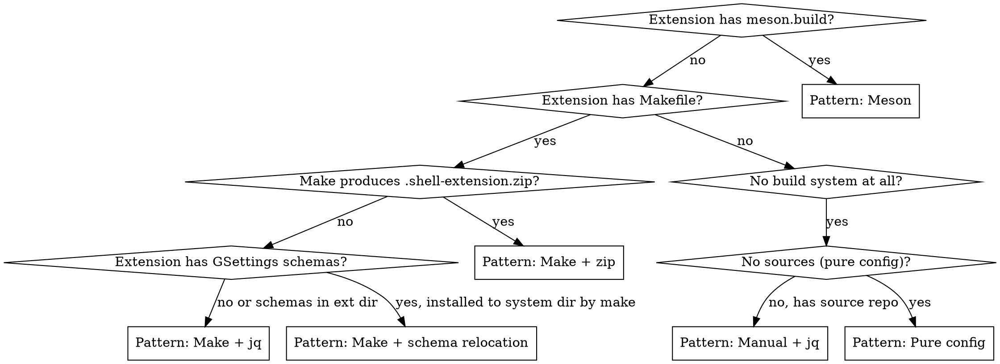

# Packaging GNOME Shell Extensions

## Overview

GNOME Shell extensions in this project follow one of 5 build patterns depending on what build system the upstream extension uses. All extensions share common traits: `strip-binaries: ""` (extensions are JavaScript, not ELF), UUID-based install paths, and aggregation under `bluefin/gnome-shell-extensions.bst`.

## When to Use

- Adding a new GNOME Shell extension to the image
- Debugging extension install path or schema compilation issues
- Understanding the UUID extraction pattern
- Choosing the right build pattern for an extension

## Pattern Selection



## Common Elements (All Patterns)

Every extension element shares:

```yaml
variables:
  strip-binaries: ""    # REQUIRED: extensions are JavaScript, not ELF

depends:
  - freedesktop-sdk.bst:components/gettext.bst
  - gnome-build-meta.bst:sdk/glib.bst
  - gnome-build-meta.bst:core/gnome-shell.bst
```

**`strip-binaries: ""`** is mandatory. Without it, BuildStream tries to strip JavaScript files and fails.

The final install command should always be `%{install-extra}` (a hook for downstream elements).

## Pattern 1: Meson (Simplest)

Use when the extension has a `meson.build` file. Meson handles installation to the correct path automatically.

**Example:** gsconnect, app-indicators

```yaml
kind: meson

sources:
  - kind: git_repo
    url: github:<org>/<repo>.git
    track: v*
    ref: <git-describe-ref>

build-depends:
  - freedesktop-sdk.bst:public-stacks/buildsystem-meson.bst
  - freedesktop-sdk.bst:components/desktop-file-utils.bst  # if extension has .desktop files

depends:
  - freedesktop-sdk.bst:components/gettext.bst
  - gnome-build-meta.bst:sdk/glib.bst
  - gnome-build-meta.bst:core/gnome-shell.bst

variables:
  strip-binaries: ""
```

No custom `config:` needed -- meson installs to the right paths.

## Pattern 2: Make + jq UUID Extraction

Use when the extension has a Makefile but no special schema handling needed. Run `make`, extract UUID with `jq`, copy files to the extensions directory.

**Example:** search-light

```yaml
kind: make

sources:
  - kind: git_repo
    url: github:<org>/<repo>.git
    track: main
    ref: <commit>

build-depends:
  - freedesktop-sdk.bst:public-stacks/buildsystem-make.bst
  - freedesktop-sdk.bst:components/jq.bst

depends:
  - freedesktop-sdk.bst:components/gettext.bst
  - gnome-build-meta.bst:sdk/glib.bst
  - gnome-build-meta.bst:core/gnome-shell.bst

variables:
  strip-binaries: ""

config:
  install-commands:
    - |
      %{make}

      _uuid="$(jq -r .uuid metadata.json)"
      install -d "%{install-root}/usr/share/gnome-shell/extensions/${_uuid}"
      cp -R ./* "%{install-root}/usr/share/gnome-shell/extensions/${_uuid}/"
    - |
      %{install-extra}
```

**Key pattern:** `%{make}` runs in `install-commands`, not `build-commands`. This gives the element control over build-then-install ordering with UUID extraction in between. The `_uuid` is extracted dynamically from `metadata.json` using `jq`.

## Pattern 3: Make + Schema Relocation

Use when `make install` puts GSettings schemas in the system-wide `/usr/share/glib-2.0/schemas/` but extensions need them in their own directory.

**Example:** dash-to-dock

```yaml
kind: make

sources:
  - kind: git_repo
    url: github:<org>/<repo>.git
    track: extensions.gnome.org-v*
    ref: <git-describe-ref>

build-depends:
  - freedesktop-sdk.bst:public-stacks/buildsystem-make.bst
  - freedesktop-sdk.bst:components/jq.bst

depends:
  - freedesktop-sdk.bst:components/gettext.bst
  - gnome-build-meta.bst:sdk/glib.bst
  - gnome-build-meta.bst:sdk-deps/sassc.bst   # only if extension uses SCSS
  - gnome-build-meta.bst:core/gnome-shell.bst

variables:
  strip-binaries: ""

config:
  install-commands:
    - |
      _uuid="$(jq -r .uuid metadata.json)"
      %{make-install}

      # Relocate schemas from system dir into extension dir and compile
      mkdir -p "%{install-root}%{datadir}/gnome-shell/extensions/${_uuid}/schemas"
      mv "%{install-root}%{datadir}/glib-2.0/schemas/<schema-name>.gschema.xml" \
         "%{install-root}%{datadir}/gnome-shell/extensions/${_uuid}/schemas"
      glib-compile-schemas --strict \
         "%{install-root}%{datadir}/gnome-shell/extensions/${_uuid}/schemas"
    - |
      %{install-extra}
```

**Key pattern:** After `%{make-install}`, move the `.gschema.xml` from the system schema dir to the extension's `schemas/` subdir, then compile with `glib-compile-schemas --strict`.

## Pattern 4: Make + Zip Extraction

Use when `make` produces a `.shell-extension.zip` file that contains the ready-to-install extension.

**Example:** blur-my-shell

```yaml
kind: make

sources:
  - kind: git_repo
    url: github:<org>/<repo>.git
    track: v*
    ref: <git-describe-ref>

build-depends:
  - freedesktop-sdk.bst:public-stacks/buildsystem-make.bst
  - freedesktop-sdk.bst:components/jq.bst

depends:
  - freedesktop-sdk.bst:components/gettext.bst
  - gnome-build-meta.bst:sdk/glib.bst
  - gnome-build-meta.bst:core/gnome-shell.bst

variables:
  strip-binaries: ""

config:
  install-commands:
    - |
      %{make}

      _uuid="$(jq -r .uuid metadata.json)"
      install -d "%{install-root}/usr/share/gnome-shell/extensions/${_uuid}"
      bsdtar xvf "build/${_uuid}.shell-extension.zip" \
        -C "%{install-root}/usr/share/gnome-shell/extensions/${_uuid}/" \
        --no-same-owner
      glib-compile-schemas --strict \
        "%{install-root}%{datadir}/gnome-shell/extensions/${_uuid}/schemas"
    - |
      %{install-extra}
```

**Key pattern:** `bsdtar` (not `unzip`) extracts the `.shell-extension.zip`. The zip path is typically `build/${_uuid}.shell-extension.zip`. Compile schemas after extraction.

## Pattern 5: Manual + jq (No Build System)

Use when the extension has no Makefile or meson.build -- just source files to copy.

**Example:** logomenu

```yaml
kind: manual

sources:
  - kind: git_repo
    url: github:<org>/<repo>.git
    track: main
    ref: <commit>

build-depends:
  - freedesktop-sdk.bst:public-stacks/buildsystem-make.bst
  - freedesktop-sdk.bst:components/jq.bst

depends:
  - freedesktop-sdk.bst:components/gettext.bst
  - gnome-build-meta.bst:sdk/glib.bst
  - gnome-build-meta.bst:core/gnome-shell.bst

variables:
  strip-binaries: ""

config:
  install-commands:
    - |
      _uuid="$(jq -r .uuid metadata.json)"

      glib-compile-schemas --strict schemas/
      install -d "%{install-root}/usr/share/gnome-shell/extensions/${_uuid}"
      cp -R ./* "%{install-root}/usr/share/gnome-shell/extensions/${_uuid}/"
    - |
      %{install-extra}
```

**Key pattern:** `kind: manual` instead of `kind: make`. Compile schemas in-source before copying. Still needs `buildsystem-make.bst` for basic tools (`install`, `cp`).

## Pattern 6: Pure Config (No Sources)

Use when you're not packaging an extension but writing a GSettings override or configuration file.

**Example:** disable-ext-validator

```yaml
kind: manual

depends:
  - gnome-build-meta.bst:sdk/glib.bst
  - freedesktop-sdk.bst:public-stacks/runtime-minimal.bst

variables:
  strip-binaries: ""

config:
  install-commands:
    - mkdir -p "%{install-root}%{datadir}/glib-2.0/schemas/"
    - |
      cat <<EOF > "%{install-root}%{datadir}/glib-2.0/schemas/zz-bluefin-<name>.gschema.override"
      [org.gnome.shell]
      some-key=some-value
      EOF
    - "%{install-extra}"
```

No sources, no build-depends. Writes directly to the system schema override directory (not the extensions dir).

## Adding to the Image

After creating the extension element, add it as a dependency of `elements/bluefin/gnome-shell-extensions.bst` (the aggregation element):

```yaml
# In elements/bluefin/gnome-shell-extensions.bst
depends:
  - bluefin/shell-extensions/your-extension.bst
  # ... other extensions
```

## Dependency Tracking

All git-sourced shell extensions are in the `bst source track` workflow's **auto-merge** group. New extensions using `git_repo` sources are automatically eligible -- just add them to the `elements:` list in `.github/workflows/track-bst-sources.yml` under the auto-merge group.

## Common Mistakes

| Mistake | Symptom | Fix |
|---|---|---|
| Missing `strip-binaries: ""` | Build fails trying to strip JavaScript files | Add `variables: strip-binaries: ""` -- required for ALL extensions |
| Hardcoding UUID instead of `jq` extraction | Works but fragile; breaks if UUID changes | Use `_uuid="$(jq -r .uuid metadata.json)"` |
| Installing schemas to system dir | Schemas not found by extension at runtime | Schemas must be inside extension dir at `extensions/<uuid>/schemas/` |
| Using `unzip` instead of `bsdtar` | Command not available in sandbox | Use `bsdtar xvf` for zip extraction |
| Missing `--no-same-owner` on `bsdtar` | Permission errors during extraction | Add `--no-same-owner` flag |
| Missing `glib-compile-schemas --strict` | Schemas not compiled; extension settings don't work | Compile schemas in the extension's schemas dir |
| Putting build in `build-commands` | UUID not available for install path | Put `%{make}` in `install-commands` for Make-based extensions |
| Missing `%{install-extra}` | Downstream hooks don't fire | Always add `%{install-extra}` as the last install command |
| Missing `jq.bst` build-dep | `jq` command not found | Add `freedesktop-sdk.bst:components/jq.bst` to build-depends |

## Real Examples

All extension elements live in `elements/bluefin/shell-extensions/`:
- **Meson:** `gsconnect.bst`, `app-indicators.bst`
- **Make + jq:** `search-light.bst`
- **Make + schema relocation:** `dash-to-dock.bst`
- **Make + zip:** `blur-my-shell.bst`
- **Manual + jq:** `logomenu.bst`
- **Pure config:** `disable-ext-validator.bst`
